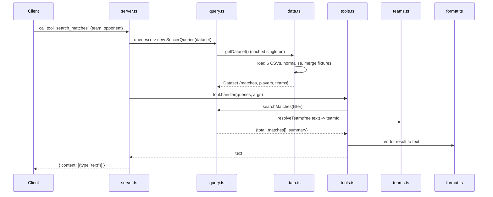

# Flow

On startup `index.ts` eagerly calls `getDataset()`, which reads the six CSVs once, folds accented names, parses multiple date formats, and merges fixtures that appear across files (league fixtures keyed by competition/season/teams; cup ties matched within a 3-day window). The resulting dataset is cached as a singleton, so the first query pays the load cost and subsequent tool calls are in-memory filters.

A tool call flows through `server.ts` (which wraps handlers so `QueryError`s become tool-level `isError` responses rather than protocol failures), into the declarative `tools.ts` handler, which validates arguments with a zod schema, delegates to a `SoccerQueries` method, and formats structured results into text via `format.ts`. Team arguments are free text resolved through `TeamRegistry` fuzzy matching, so "Sao Paulo", "São Paulo-SP" and "Sao Paulo FC" all resolve to one canonical team.

Notable: input is schema-validated (zod); errors are surfaced as helpful tool messages with suggestions; standings/brackets are computed from match results rather than hardcoded; duplicate-fixture merging and season-boundary handling (e.g. COVID-delayed 2020 season) are explicit; FIFA-19 licensing gaps (e.g. Flamengo absent) are detected and explained rather than silently returning empty.
