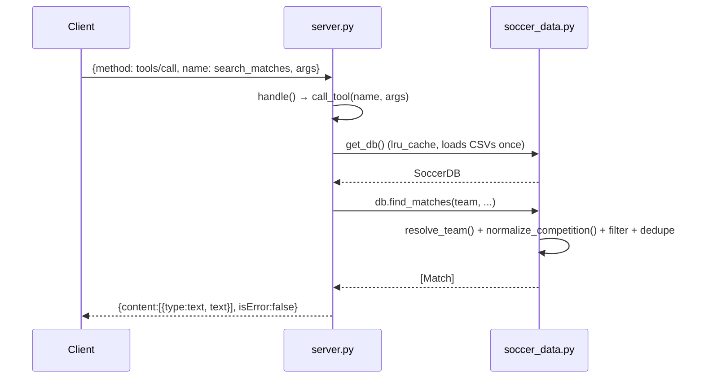

# Flow

A `tools/call` request is dispatched by `handle()` to `call_tool()`, which strips `None` args and invokes the matching Python function in `server.py`. That function calls `get_db()` — an `lru_cache(maxsize=1)` singleton that parses all six CSVs on first use (team names normalized, overlapping match sources deduped by a source-priority heuristic) — then runs the query on `SoccerDB` and formats the result into a human-readable text block returned as MCP `content`. Tool exceptions are caught and returned in-band with `isError:true` rather than as JSON-RPC errors.

Notable: pure standard library (no MCP SDK, no pandas — `csv` only); the entire corpus is loaded into memory eagerly on the first call; results are returned as preformatted strings rather than structured JSON, so consumers parse text. Team-name normalization and cross-source dedupe are the most intricate logic and the main correctness risk.
