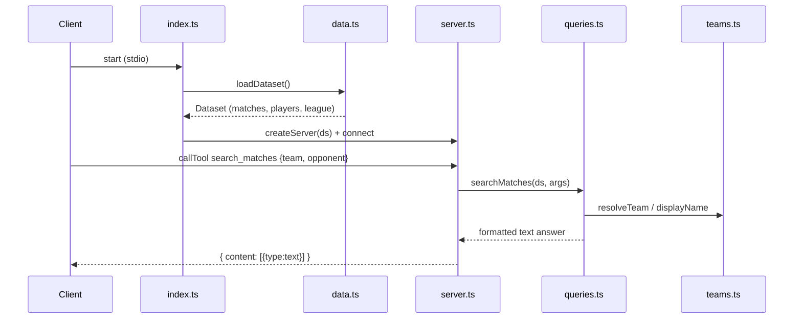

# Flow

On startup `index.ts` loads all six CSVs via `loadDataset()` (parsing dates in multiple formats, normalising team names, deduplicating overlapping sources, and picking one preferred source per Brasileirão season for league tables), then registers 14 MCP tools. Each tool call is wrapped in try/catch: the query functions return a pre-formatted text block, and errors are surfaced as `isError` MCP results rather than thrown. Team inputs are resolved to canonical keys through `teams.ts` (accent-stripping, alias table, state-suffix removal, substring fallback). No network access at query time — all answers come from the in-memory dataset.
