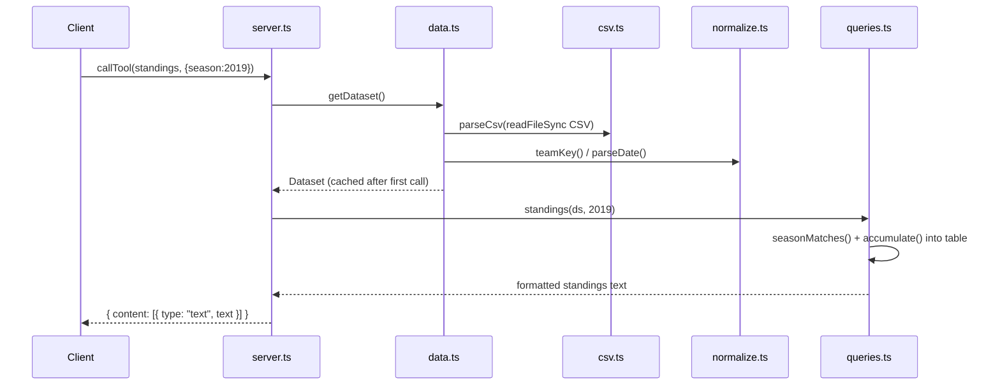

# Flow

A tool call enters `server.ts`, which lazily loads and caches the full dataset via `getDataset()` on first use (each of the 6 CSVs is parsed by `csv.ts` and normalized through `normalize.ts`, with overlapping match rows deduplicated). The handler then calls the matching `queries.ts` function, which filters/aggregates the in-memory arrays and returns a human-readable string. Every handler is wrapped in `text()`, which catches thrown errors (e.g. an unknown competition from `parseCompetition`) and returns them as `isError: true` MCP responses rather than crashing. All data access is synchronous and in-memory; there are no external API calls or database. Notable: queries reach the data through a module-level singleton (`cached`), which is also what the tests consume directly.
