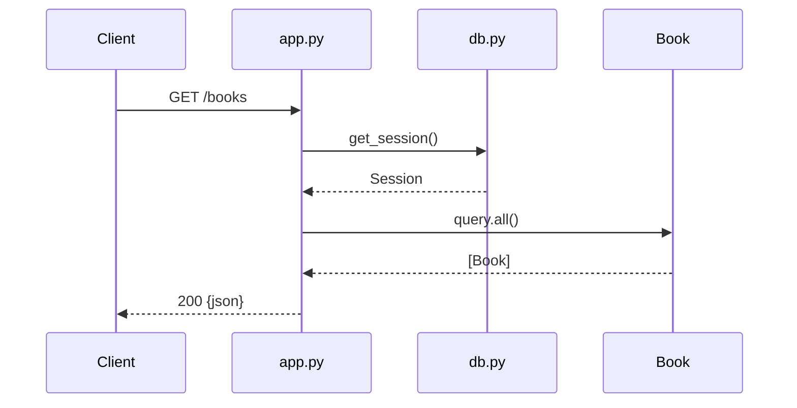

# Run Summary

## Overview

Retort runs produce small, single-task codebases (one REST API, one CLI, one service). Full codebase-summary treatment is overkill — but a consistent lightweight summary per run is exactly what makes cross-run comparison useful.

This skill is an intentionally scoped-down adaptation of pourpoise's `codebase-summary`. It runs in seconds, not minutes, and emits only what's useful when comparing 48+ small generated projects.

## Parameters

- **codebase_path** (required): The run directory (same as `evaluate-run`'s `run_dir`)
- **output_dir** (optional, default: `{codebase_path}/summary`): Where to write the summary files

## Steps

### 1. Infer the surface

Read `TASK.md` to understand what the code is supposed to do — the "surface" of the project. One paragraph, no judgments.

### 2. Map the modules

Generate `{output_dir}/modules.md`:

```markdown
# Modules

| Path | Purpose | Entry points |
|------|---------|--------------|
| src/app.py | HTTP server, route handlers | `app`, `create_app()` |
| src/models.py | SQLAlchemy models | `Book`, `Base` |
| src/db.py | Connection + migrations | `get_engine()` |
| tests/test_app.py | API integration tests | 8 test functions |
```

Constraints:
- You MUST list every non-generated source file (skip `node_modules`, `target`, `__pycache__`, `.git`, lock files, build artifacts).
- The "Purpose" column is one line extracted from the code, not invented.
- The "Entry points" column is the publicly-named functions, classes, or exported symbols — not every local helper.

### 3. Describe the interfaces

Generate `{output_dir}/interfaces.md` covering what the code exposes:

- HTTP routes (method, path, short description)
- CLI commands (subcommand + flags)
- Library API (exported classes/functions)
- Data schemas (tables, message formats)

Example:

```markdown
# Interfaces

## HTTP routes

| Method | Path | Returns | Handler |
|--------|------|---------|---------|
| GET | /books | `[Book]` | `app.py:list_books` |
| POST | /books | `Book` | `app.py:create_book` |
| GET | /books/{id} | `Book \| 404` | `app.py:get_book` |

## Data schema

`books` table: id (int, pk), title (str), author (str), year (int).
```

Constraints:
- You MUST grep / static-analyze the code rather than execute it to discover interfaces.
- You MUST NOT invent endpoints the code doesn't actually declare.
- If the code has none of the above categories, write `(none)` under that heading.

### 4. Trace the dominant control flow

Generate `{output_dir}/flow.md` with one Mermaid diagram showing the happy-path request/response for the main feature, plus a one-paragraph narration.

```markdown
# Flow



A request to `GET /books` opens a DB session via `db.py:get_session()`, queries all `Book` rows, and returns them as JSON. No pagination, no filtering.
```

Constraints:
- You MUST pick the single most representative flow — the one a user of the generated code would hit first.
- You MUST note deviations from common patterns ("no input validation", "no error handling", "synchronous DB access in async handler").
- The narration MUST be factual, not prescriptive.

### 5. Write the index

Generate `{output_dir}/index.md` linking to the other three files and giving a 3–4 bullet summary:

```markdown
# Summary: {cell_name} · rep {replicate}

- **Shape:** {one-line description — "Flask REST API with SQLAlchemy", "Go net/http CRUD with in-memory store", etc.}
- **Structure:** {n} modules, {n} test files
- **Interfaces:** {n} HTTP routes / {n} CLI commands / {n} exported functions
- **Notable:** {what stands out — simplest/most-complex approach seen, unusual library choice, etc.}

See [modules.md](modules.md), [interfaces.md](interfaces.md), [flow.md](flow.md).
```

## Constraints Summary

- You MUST finish in under 90 seconds wall-clock. This is the fast-path summary.
- You MUST NOT read anything under `node_modules/`, `target/`, `__pycache__/`, `.git/`, `dist/`, `build/`.
- You MUST write exactly four files: `index.md`, `modules.md`, `interfaces.md`, `flow.md`. No more, no less.
- You MUST keep descriptions factual — no quality judgments (that's `evaluate-run`'s job).
- Output files MUST be valid markdown that renders correctly in GitHub's viewer (Mermaid in a ```mermaid fenced block).

## Troubleshooting

**Code is unparseable / generated output is garbage**
- Write the index.md with `**Shape:** unparseable — agent output did not produce a valid project`.
- Leave the other files near-empty with a one-line explanation.
- Exit 0 so `evaluate-run` can still complete.

**Too many files to summarize**
- This shouldn't happen in retort's small-task workspaces. If it does, cap the modules table at 50 rows and note the truncation in index.md.
